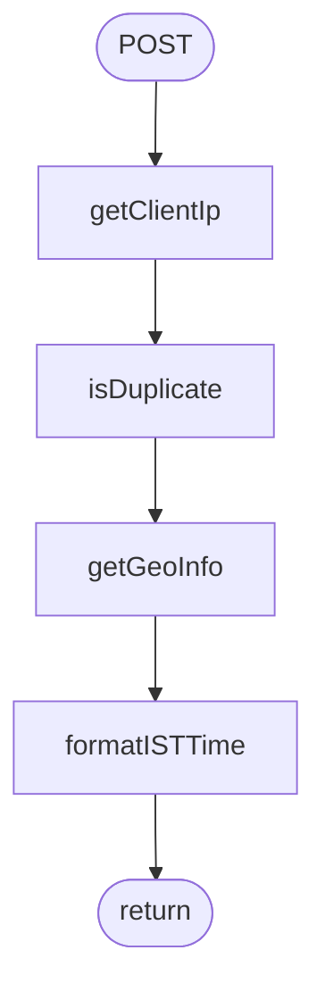

# App

_Auto-generated feature documentation for `app/`._

## Functions

### `ArchDiagram`

ArchDiagram is an application that creates visual diagrams of architectural designs or systems.

### `POST`

The POST function sends data to a server to create or update a resource.

### `Portfolio`

The Portfolio app allows users to create and manage their financial portfolios, track investments, and analyze performance.

### `ProjectDetailPage`

The ProjectDetailPage displays detailed information about a specific project.

### `RootLayout`

The RootLayout app function serves as the foundational structure for organizing and displaying other components in a user interface.

### `SectionLabel`

The SectionLabel app function adds labels or headers to organize sections within an interface for better navigation and user experience.

### `StepIcon`

The StepIcon app function displays step icons to help users track their progress or stages in a process visually.

### `formatISTTime`

The `formatISTTime` function formats a given date and time string according to Indian Standard Time (IST).

### `generateMetadata`

The "generateMetadata" app function creates descriptive data for digital assets such as images, videos, or documents to enhance searchability and accessibility.

### `generateStaticParams`

The `generateStaticParams` function generates static parameters for dynamic routes in Next.js applications.

### `getClientIp`

The `getClientIp` function retrieves the IP address of the client making a request.

### `getGeoInfo`

The `getGeoInfo` function retrieves geographical information based on a provided location identifier.

### `isDuplicate`

The `isDuplicate` function checks if an item exists in a list and returns true if it does, otherwise false.

## Diagrams

### POST()

