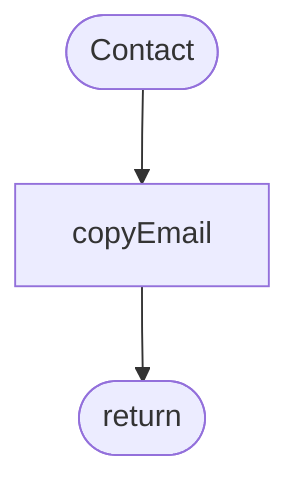
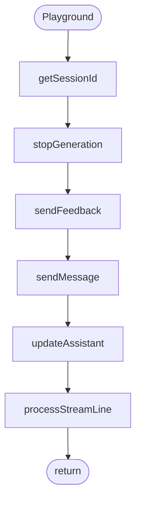
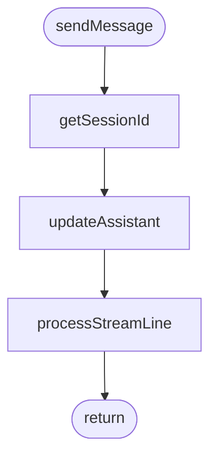
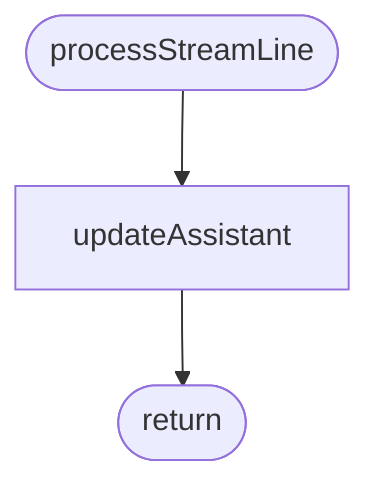
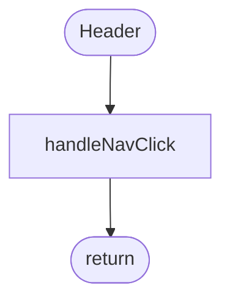

# Components

_Auto-generated feature documentation for `components/`._

## Functions

### `Contact`

The Contact component is used to display and manage contact information within an application or website.

### `Experience`

The Experience function is designed to enhance user interaction and satisfaction through intuitive design and seamless functionality.

### `Github`

The GitHub function allows users to store, share, and manage their code projects online.

### `Header`

The Header component displays a title and navigation links at the top of a webpage or application for easy access to different sections or features.

### `Hero`

The Hero component is used to create visually appealing and attention-grabbing sections on a webpage or application that highlight key features or messages.

### `Linkedin`

The LinkedIn function integrates and displays professional networking features such as connecting with others, sharing updates, and accessing job opportunities on a platform designed for career development and collaboration.

### `Playground`

The Playground component provides an interactive environment for testing and experimenting with code snippets or applications in real-time.

### `Projects`

The Projects component manages and displays all project-related data within an application or system, allowing users to create, view, edit, and delete projects as needed.

### `Skills`

The Skills component manages and displays user abilities or competencies.

### `copyEmail`

The `copyEmail` function copies an email address to the user's clipboard.

### `getSessionId`

The `getSessionId` function retrieves and returns the session ID for the current user session.

### `handleNavClick`

The `handleNavClick` function manages navigation actions based on user interactions within a component.

### `onScroll`

The `onScroll` function is triggered when an element is scrolled.

### `processStreamLine`

The `processStreamLine` function processes and analyzes data in real-time streams to extract meaningful insights or perform specific operations on the data as it flows through the system.

### `sendFeedback`

The `sendFeedback` function sends user feedback to a server for processing and analysis.

### `sendMessage`

The `sendMessage` function sends a message to a specified recipient or channel.

### `stopGeneration`

The `stopGeneration` function halts the process of generating content or data.

### `updateAssistant`

The `updateAssistant` function updates an assistant's knowledge or capabilities based on new data or instructions provided.

## Diagrams

### Contact()

### Playground()

### sendMessage()

### processStreamLine()

### Header()

